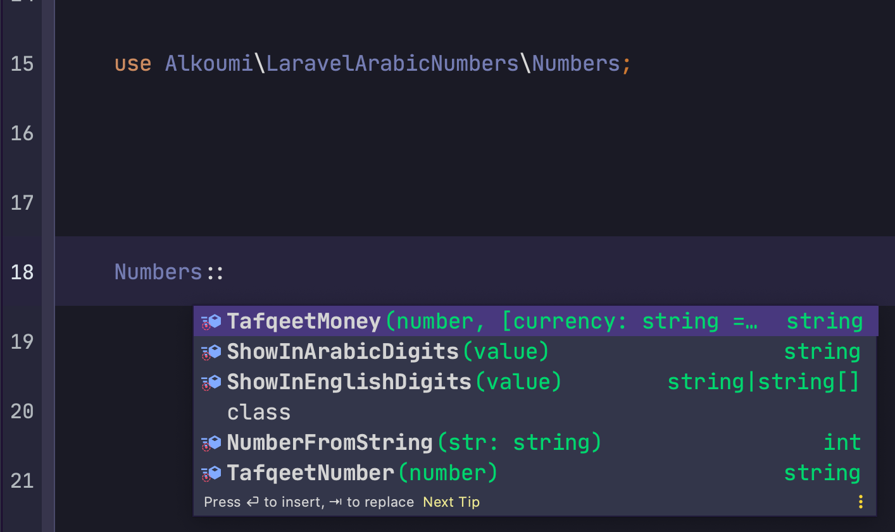

# Laravel Arabic Numbers
Laravel package to handel ANY THING about our Amazing 💝 Arabic Numbers Functions { كل ما يهم محبي لارافيل واستخدام الأرقام العربية مثل تفقيط الأرقام والمبالغ المالية والعكس و عرض الأرقام بالعربية والعكس }

    [](//packagist.org/packages/alkoumi/laravel-arabic-numbers) 
## كل ما يهم محبي لارافيل واستخدام الأرقام العربية مثل تفقيط الأرقام والمبالغ المالية والعكس و عرض الأرقام بالعربية والعكس 
## Installation for all Laravel Versions 🥳
You can install the package via composer:

    composer require alkoumi/laravel-arabic-numbers

The service provider will automatically get registered. Or you may manually add the service provider in your `config/app.php` file:

    'providers' => [
        // ...
        Alkoumi\LaravelArabicNumbers\LaravelArabicNumbersServiceProvider::class,
    ];

## لحل مشكلة استقبال المدخلات التي تحتوي أرقام باللغة العربية استخدمنا Middleware 
This custom Middleware 🤝 `ConvertArabicDigitsToEnlishMiddleware::class` 

    Alkoumi\LaravelArabicNumbers\Http\Middleware\ConvertArabicDigitsToEnlishMiddleware::class 
    
will automatically 🤩 registered 🤗 in 

    Illuminate\Contracts\Http\Kernel::class
    
so any request have arabic indic [١،٢،٣،٤،٥،٦،٧،٨،٩،٠] Numbers will Translated 🥳 to [1,2,3,4,5,6,7,8,9,0] 

## Excepting Fields 
If you want to except any field from transforming request, Just add the fields you want to except them in the Middleware `ConvertArabicDigitsToEnlishMiddleware::class` :

	        /**
             * The fields that should not be Transformed.
             *
             * @var array
             */
            protected $except = [
                'password', 'password_confirmation' ,'numbers','count'
            ];

## Usage


##   تفقيط المبالغ المالية باللغة العربية الفصحى مثل 123 => { مئة و ثلاثة و عشرون ريالًا فقط لا غير } 
You can simply get Tafqeet of The int Money amount directly in Arabic idioms 
```php
    use Alkoumi\LaravelArabicNumbers\Numbers;

    $number = 64.56;
    Numbers::TafqeetMoney($number); //It will Give SAR by default

    // RESULT {  أربعة و ستون ريالًا و ست و خمسون هللة فقط لا غير }


    [OR]


    $value = 64.56;
    Numbers::TafqeetMoney($value,'EGP'); //You can pass $currency as the second @param

    // RESULT {  أربعة و ستون جنيهًا و ست و خمسون قرش فقط لا غير }
```

##   تفقيط الأرقام باللغة العربية الفصحى مثل 64 => { أربعة و ستون } 
You can simply get Tafqeet of The int Value directly in Arabic idioms 
```php
    use Alkoumi\LaravelArabicNumbers\Numbers;

    $number = 64;
    Numbers::TafqeetNumber($number);

    // RESULT {  أربعة و ستون }
```
## إستخراج الأرقام من التفقيط باللغة العربية للأرقام وليس للمبالغ 😉 مثل { أربعة و ستون } => 64
You can simply Reverse Tafqeet in Arabic idioms to The int Number directly 
```php
    use Alkoumi\LaravelArabicNumbers\Numbers;

    $string = "أربع و ستون فاصلة ست و خمسون";
    Numbers::NumberFromString($number);

    // RESULT 64.56
```
## عرض الأرقام العربية بدل الأرقام الإنجليزية والعكس حسب رغبة المستخدم 657 =>  ٦٥٧
You can simply Show Any Value in Arabic Digits Or English Digits
```php
    use Alkoumi\LaravelArabicNumbers\Numbers;

    $number = 64; // integar value
    Numbers::ShowInArabicDigits($number);

    // RESULT "٦٤.٥٦"


    [OR]


    use Alkoumi\LaravelArabicNumbers\Numbers;

    $value = "٦٤.٥٦"; // Can be Any Value STRING or INTEGAR
    Numbers::ShowInEnglishDigits($value);

    // RESULT "64.56"


    [EVEN 🥳 Any Value]


    use Alkoumi\LaravelArabicNumbers\Numbers;

    $value = "تاريخ اليوم : 22-10-2020"; // Can be Any Mix Value STRING with INTEGAR
    Numbers::ShowInArabicDigits($value);

    // RESULT {تاريخ اليوم : ٢٢-١٠-٢٠٢٠}
```
#### Give Me 💗 Cup of ☕️ Coffee here https://patreon.com/mohammadelkoumi

